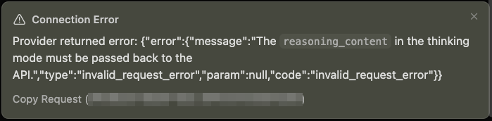
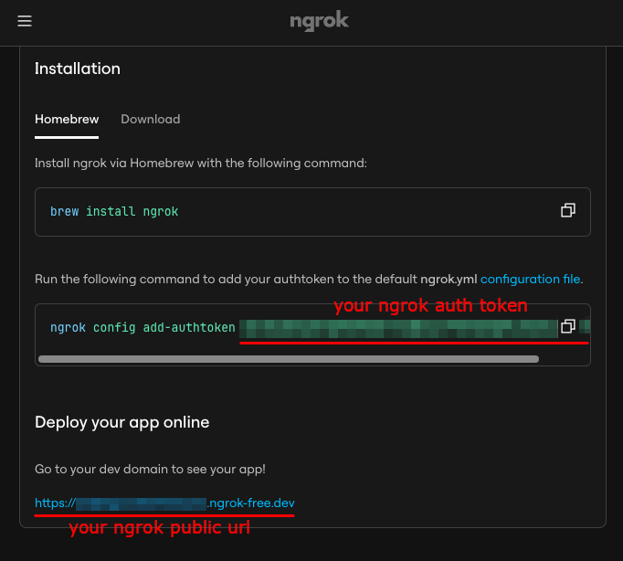
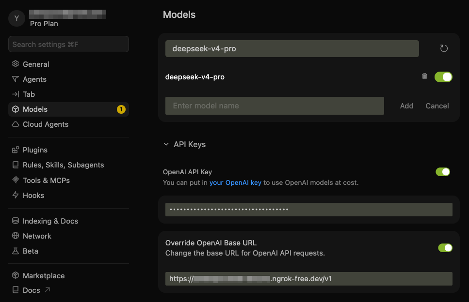
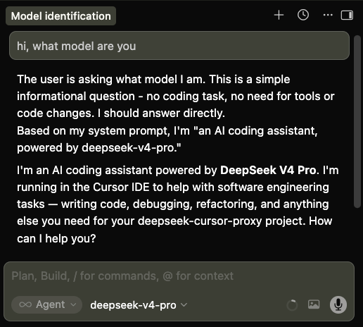

<!-- <h1>&nbsp;DeepSeek Cursor Proxy</h1> -->
<h1 align="center"><br>DeepSeek Cursor 代理</h1>

一个兼容性代理，通过正确处理 DeepSeek 工具调用推理 API 请求中的 `reasoning_content` 字段，将 Cursor 连接到 DeepSeek 思考模型（`deepseek-v4-pro` 和 `deepseek-v4-flash`）。还支持把 Cursor 中发送的图片转发给 DeepSeek 视觉模型（`deepseek-v4-flash-vision-exp` / `deepseek-flash`）。

此代理还可以帮助 **Cursor 以外的其他应用和编程代理**，当它们遇到 DeepSeek 思考模式 API 中缺少 `reasoning_content` 的相同问题时。只需将它们的 API 基础 URL 指向此代理即可。

## 功能

- ✅ 向发出的工具调用请求注入 `reasoning_content`，因为 Cursor 不包含该字段，可从常规和流式 DeepSeek 响应中恢复先前缓存的推理。详见 [DeepSeek 文档](https://api-docs.deepseek.com/guides/thinking_mode#tool-calls)。
- ✅ 通过将 DeepSeek 的思考令牌转发到 Cursor 可见的可折叠 Markdown `<details><summary>思考</summary>...</details>` 块中，在 Cursor 中显示思考内容。
- ✅ 启动 ngrok 隧道，使 Cursor 可通过公网 HTTPS URL 访问本地代理。
- ✅ 提供其他兼容性修复，使 DeepSeek 模型在 Cursor 中良好运行。

## 为什么需要它

本仓库修复了启用思考模式时 Cursor + DeepSeek 工具调用的以下错误：



```txt
⚠️ 连接错误
提供商返回错误：
{
  "error": {
    "message": "The reasoning_content in the thinking mode must be passed back to the API.",
    "type": "invalid_request_error",
    "param": null,
    "code": "invalid_request_error"
  }
}
```

## 使用方法

### 步骤 1：设置 ngrok

Cursor 会阻止非公开 API URL（如 `localhost`），因此代理需要公网 HTTPS URL。[ngrok](https://ngrok.com/) 可将本地代理暴露给 Cursor，无需打开路由器端口。也可使用 [Cloudflare Tunnel](https://developers.cloudflare.com/tunnel/setup/)。创建 ngrok 账户并访问 [ngrok 控制台](https://dashboard.ngrok.com)，可在那里找到 authtoken 和公网 URL。

如果将此代理用于允许 localhost API 端点的其他应用，可在 `~/.deepseek-cursor-proxy/config.yaml` 中设置 `ngrok: false`，或使用 `--no-ngrok` 启动代理，完全跳过此步骤。



然后，安装并一次性认证 ngrok：

```bash
brew install ngrok
ngrok config add-authtoken <your-ngrok-token>
```

### 步骤 2：安装并启动代理服务器

**使用 UV 运行**

```bash
# 如未安装 uv，先安装
curl -LsSf https://astral.sh/uv/install.sh | sh

# 安装并启动
# uv 会在仓库本地 .venv/ 目录下安装程序
git clone https://github.com/yxlao/deepseek-cursor-proxy.git
cd deepseek-cursor-proxy
uv run deepseek-cursor-proxy
```

**使用 Conda 运行**

```bash
# 如未安装 conda，先安装
# 参考: https://www.anaconda.com/docs/getting-started/miniconda/install/overview

# 安装
conda create -n dcp python=3.10 -y
conda activate dcp
git clone https://github.com/yxlao/deepseek-cursor-proxy.git
cd deepseek-cursor-proxy
pip install -e .

# 启动
deepseek-cursor-proxy
```

启用 ngrok 时，`deepseek-cursor-proxy` 会在启动时打印 ngrok 公网 URL。若与 Cursor 中的不同，请在 Cursor 的 Base URL 字段中更新。

如果使用 **保留的 ngrok 端点或自己的域名**（而非 ngrok 分配的 URL），通过 `--url=…` 传递给 ngrok 代理。在 `~/.deepseek-cursor-proxy/config.yaml` 中设置 `ngrok_url`，或在命令行使用 `--ngrok-url`（参见 `ngrok http --help`）。示例：

```yaml
ngrok: true
ngrok_url: https://your-subdomain.ngrok.dev
```

```bash
deepseek-cursor-proxy --ngrok-url https://your-subdomain.ngrok.dev
```

首次运行时，`deepseek-cursor-proxy` 会创建：

- `~/.deepseek-cursor-proxy/config.yaml`：配置文件
- `~/.deepseek-cursor-proxy/reasoning_content.sqlite3`：reasoning 内容缓存

持久化设置位于 `~/.deepseek-cursor-proxy/config.yaml`。也可用命令行参数覆盖配置，例如：

```bash
# 在 Cursor UI 中隐藏思考令牌
deepseek-cursor-proxy --no-display-reasoning

# 显示完整入站和出站请求
deepseek-cursor-proxy --verbose

# 不使用 ngrok 运行（直接在 localhost 上运行）
deepseek-cursor-proxy --no-ngrok

# 使用固定的 ngrok 公网 URL（保留端点/自定义域名）
deepseek-cursor-proxy --ngrok-url https://your-subdomain.ngrok.dev

# 使用不同的本地端口
deepseek-cursor-proxy --port 9000

# 强制把图片转发给上游（自定义视觉端点/新模型别名时使用）
deepseek-cursor-proxy --vision on
```

### 步骤 3：在 Cursor 中添加自定义模型

在 Cursor 中添加 DeepSeek 自定义模型并指向此代理：

- 模型：`deepseek-v4-pro`
- API Key：你的 DeepSeek API 密钥
- Base URL：带 `/v1` API 版本路径的 ngrok HTTPS URL

代理会尊重 Cursor 发送的 DeepSeek 模型名称，如 `deepseek-v4-pro` 或 `deepseek-v4-flash`。`config.yaml` 中的 `model` 字段仅在请求未包含模型时作为回退使用。

**发送图片：** 在 Cursor 中选择支持视觉的模型名（如 `deepseek-v4-flash-vision-exp` 或 `deepseek-flash`），代理会把消息中的图片块原样转发给上游，包括 Cursor 粘贴图片的 base64 data URL 与外部 HTTP(S) 链接。非视觉模型收到图片时会自动降级为文本占位符（`vision: auto` 默认行为）；可用 `--vision on` 强制转发、`--vision off` 始终禁用。注意两点：DeepSeek 只接受 `user` 消息中的图片；base64 图片会计入请求体大小（代理默认上限 48 MiB，与上游一致）。

例如，若 ngrok 控制台显示 `https://example.ngrok-free.dev`，请使用：

```text
https://example.ngrok-free.dev/v1
```



注意：可通过以下快捷键切换自定义 API 的开关：

- macOS：`Cmd+Shift+0`
- Windows/Linux：`Ctrl+Shift+0`

### 步骤 4：在 Cursor 中与 DeepSeek 对话

在 Cursor 中选择 `deepseek-v4-pro`，像往常一样使用聊天或代理模式。



## 工作原理

- **核心修复：** DeepSeek [思考模式工具调用](https://api-docs.deepseek.com/guides/thinking_mode#tool-calls) 要求在后续请求中传回完整的**多轮** `reasoning_content` 链。Cursor 省略该字段会导致 400 错误。代理（`Cursor -> ngrok -> 代理 -> DeepSeek API`）存储 DeepSeek 原始的 `reasoning_content`，并将缺失的块补回发出的工具调用历史。
- **多对话隔离：** 为避免并发对话之间的冲突，代理通过规范对话前缀（角色、内容和工具调用，不含 `reasoning_content`）的 SHA-256 哈希，加上上游模型、配置和 API 密钥哈希来限定缓存键作用域。不同线程获得不同作用域，复用的工具调用 ID 不会冲突。字节级相同的克隆历史产生相同作用域。
- **上下文缓存兼容性：** 代理通过从不注入合成线程 ID、时间戳或 cache-control 消息来保持兼容性。它以原始字符串精确恢复 `reasoning_content`，使重复前缀保持完整以支持 [DeepSeek 上下文缓存](https://api-docs.deepseek.com/guides/kv_cache)。缓存命中率会记录在终端输出中。
- **其他兼容性修复：** 除 reasoning 修复外，代理还将旧版 `functions`/`function_call` 字段转换为 `tools`/`tool_choice`，保留 required 和 named 工具选择语义，规范化 `reasoning_effort` 别名，从助手内容中剥离镜像的思考显示块，在非视觉模型下将多部分内容数组展平为纯文本、在视觉模型下保留并将各客户端（OpenAI / Responses / Anthropic 风格）的图片块统一规范化为 `image_url` 格式，并将 `reasoning_content` 镜像到 Cursor 可见的 Markdown details 块中。

## 开发

运行单元测试：

```bash
uv run python -m unittest discover -s tests
```

运行 pre-commit 钩子（代码格式化和 lint）：

```bash
uv sync --dev
uv run pre-commit run --all-files
```

## 调试

使用详细输出运行：

```bash
deepseek-cursor-proxy --verbose
```

不使用 ngrok 进行本地 curl 测试：

```bash
deepseek-cursor-proxy --no-ngrok --port 9000 --verbose
```

捕获完整结构化请求追踪用于调试：

```bash
deepseek-cursor-proxy --verbose --trace-dir ./trace-dumps
```

使用其他配置文件：

```bash
deepseek-cursor-proxy --config ./dev.config.yaml
```

清除本地 reasoning 缓存：

```bash
deepseek-cursor-proxy --clear-reasoning-cache
```
